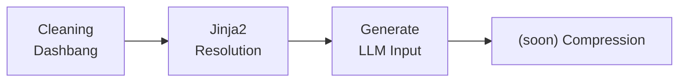

# Instruct (`.instruct`) File Format

## Introduction

This document introduces the Instruct (`.instruct`) file format, a new standard designed to streamline and enhance the process of generating inputs for large language models (LLMs) within development workflows. The `.instruct` format is a composition of jinja2 templating, HTML-like custom tagging for document formatting, and unstructured pseudo-code, enabling a flexible, powerful approach to crafting LLM prompts.

## Key Principles

1. Prompting is coding: jinja2 templating and pseudo-code for dynamic, complex prompts.
2. Divide and conquer: unified prompting library for easy multi-LLM architecture strategy.
3. Token poor: reduce the token size of the prompt to optimize the LLM input.

## Motivation

As our reliance on LLMs increases, the complexity and variety of prompts we need to generate have grown. Traditional methods of prompt creation often involve a cumbersome, error-prone process of manually editing and formatting text, lacking standardization and efficiency. The `.instruct` format aims to address these challenges by providing:

- **Standardization:** A unified file format allows for consistent prompt creation across different projects and teams.
- **Efficiency:** The use of jinja2 templating and custom tags streamlines the process of generating dynamic, complex prompts.
- **Flexibility:** Support for unstructured pseudo-code and custom tags ensures that developers can express a wide range of logic and formatting requirements.
- **Version Control:** A dash bang style header in each `.instruct` file specifies the LLM model version, author, and additional metadata, facilitating better management and compatibility of prompt templates over time.

## `.instruct` File Format Specification

### Header

The `.instruct` file begins with a dash bang style header that includes essential metadata:

``` bash
#! gpt4-turbo/2023-03-15-preview
#! gpt-4-turbo-preview
```

### Body

The body of the `.instruct` file contains a mix of jinja2 templates, custom HTML-like tags, and pseudo-code:


```html
This is the output I expect from you:
<title>Hello, {{ name }}! This is a sample template.</title>    
<content><if not all informations required display a special message, otherwise do something></content>

```

## Advanced Templating Techniques

To accommodate the unique requirements and capabilities of different LLM models within a single Instruct file, advanced templating techniques are employed. This approach allows developers to specify model-specific prompts and logic, ensuring optimal interaction with each model's unique interpretation and response characteristics.

### Example of Model-Specific Templating

Consider a scenario where different models, such as `mistral-medium`, `gpt-4-turbo`, and `mistral-large`, require tailored prompts to achieve the same task. The `.instruct` file can contain directives (shebangs) and conditional templating to customize the prompt for each model:

```plaintext
#! mistral:instruct
#! mistral-medium
#! gpt4-turbo/2023-03-15-preview
#! gpt-4-turbo-preview
#! mistral-large

YOUR CONTEXT
{{some_knowledge}}

GLOBAL CONTEXT
{{global_context}}

USER NAME
{{username}}

USER'S COMPANY KNOWLEDGE
{{user_company_knowledge}}

Here is the task achieved by your user.
-------
TASK TO ACCOMPLISH
{{task_name}}: {{task_definition}}

USER INPUTS
{{ user_task_inputs | tojson(indent=4) }}

CONVERSATION
{{ user_messages_conversation }}
-------

{# fewshot for small models like mistral7b, i.e. mistral:instruct with ollama #}

EXAMPLES OF GOOD EXECUTIONS OF THE TASK SUMMARIZATION:

EXAMPLE 1:
------
TASK TO ACCOMPLISH
structure_ideas_into_doc: The user needs assistance to turn ideas into a structured written doc

USER INPUTS:
pr\\u00e9pare une note de musique

TASK RESULT:
<title>Structuration d'une Note de Musique</title>
<summary>Assistance fournie pour transformer des id\u00e9es en un document structur\u00e9. Le sujet principal \u00e9tait la pr\u00e9paration d'une note de musique. Le processus a impliqu\u00e9 la transcription et l'organisation des id\u00e9es fournies.</summary>
------


Give a title to this task execution so that the user can remember what the task was about. Give important information in the title such as names, subjects...
Make a summary of this task execution so that the user can remember what the task was about.
Summary is addressed to the user. No need to call them.
10 words max for the title and 3 sentences max for the summary.
Format:
<title>TITLE</title>
<summary>SUMMARY</summary>

Use the same language as the user.
No talk, just title and summary.
```

This example showcases how to define complex logic and conditionally include content based on the model being used, offering unparalleled flexibility in crafting prompts for diverse LLMs.


## Instruct Workflow

Developers create `.instruct` files following the format specification. The runtime sequence involves:



1. **Cleaning Dashbang:** The header is cleaned from the processing input to the LLM.
2. **Jinja2 Resolution:** Templates are processed to substitute variables and expressions with actual values.
3. **Generate LLM Input:** The cleaned, resolved template serves as the input for the appropriate LLM.
4. **(soon) Compression:** Optimize the LLM input with compression algorithms to reduce the token size – this is optional and depends on the LLM model & tokenizer.

## Example

!!! info "file translation.instruct"
    ```
    #! gpt4-turbo/2023-03-15-preview
#! gpt-4-turbo-preview
    #! mistral-large

    Translate this text to {{language}}:
    <text_start>
    {{text}}
    <text_end>
    If text is already in {{language}}, return it as is.
    No talk, just translation.
    Do not include tags in response.


    ```

!!! code Usage
    ```python
    >>> instruct = Instruct('translation.instruct', text='hello', language='english')
    >>> print(instruct)
    Instruct: translation.instruct
    
    >>> print(instruct.prompt)
    Translate this text to english:
    <text_start>
    hello
    <text_end>
    If text is already in english, return it as is.
    No talk, just translation.
    Do not include tags in response.
    
    
    
    >>> print(instruct.dashbangs)
    [{'model_name': 'gpt-4-turbo', 'version': '2023-03-15-preview'}, {'model_name': 'mistral-large', 'version': 'latest'}]
    
    >>> print(instruct.models)
    ['gpt-4-turbo', 'mistral-large']
    
    >>> print(instruct.tags) 
    ['<text_start>', '<text_end>']   
    ```

